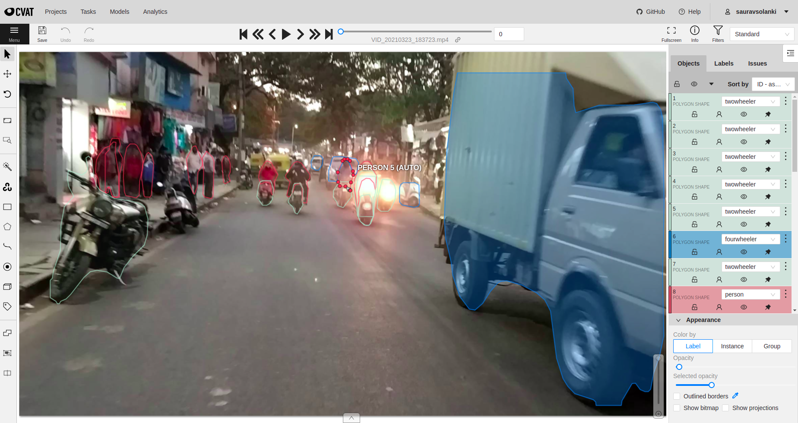

# Vehicle Detection in the WILD

Object Recognition can solve many real-world problems around us but the current research in ML Domain happens
to be focused on dataset that is standardised, clear and clean. In the Indian scenario context, there is a lot of uncertainty that
we counter with because of non-standard practices that add more real challenge to understanding the scene, for better decision making.
Example: Imagine a crowded two lane road in a metropolitan city. You will see lots of objects and its complex relationship in scene.
All these interlinked relations makes it really hard to make decisions.

For better understanding of task, I have trained MaskRCNN-Model and created dataset from scratch using cvat tools. I am able to achieve 0.54 mAP.

## Dataset:
1. Make a 3 video in busy city of Bangalore, keeping mobile camera in hand over a bike. Got around: 15000 Image. After cleaning and clearing, It concludes to 6000 Images
2. Load the Data in CVAT and Annotation it with auto-annotation model and track feature of tools. It takes around 1 hours to get 1000 Images
3. Exported in label-me format

## Model:
1. Trained a Mask R-CNN Model for Object Detection and Segmentation: This is an implementation of [Mask R-CNN](https://arxiv.org/abs/1703.06870) on Python 3, Keras, and TensorFlow. Ref: [Matterport MaskRCNN](https://github.com/matterport/Mask_RCNN)

2. Jupyter Notebook, `Kaggle-training.ipyb`: Model Trained and Inference in Kaggle GPU Notebook

3. Config File 
  ``` # define a configuration for the model
  class MathikereTrainConfig(Config):
      # define the name of the configuration
      NAME = "mathikere_cfg"
      # number of classes (background + no of class)
      NUM_CLASSES = 1 + 3
      
      GPU_COUNT = 1
      IMAGES_PER_GPU = 1
      
      # number of training steps per epoch
      STEPS_PER_EPOCH = 13
  ```

4. Dataset Loader:  MathikereDataset(Dataset) class
5. Epoch: Head-epoch: 5 and E2E-Model: 20 

## Inference Video
[](https://www.youtube.com/watch?v=n03m9lC32H0)


### CVAT Annotation




## Requirements
Python 3.7.8, TensorFlow 2.0, and other common packages listed in `requirements.txt`.


## Installation
1. Clone this repository
2. Install dependencies
   ``` pip3 install -r requirements.txt ```
3. Run setup from the repository root directory
    ``` python3 setup.py install ``` 

